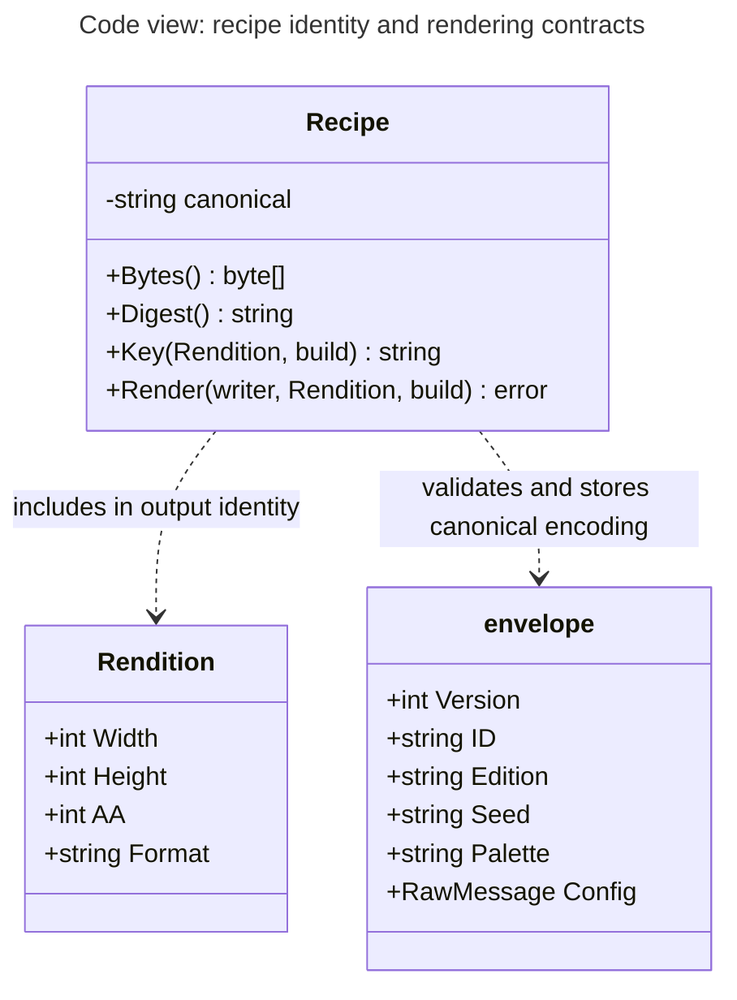

# Code view: recipe identity and rendering contracts

Scope: the Recipe execution component in the render child. The prose connects its contract to public job admission. Audience: developers changing configuration, caching or protocol validation.

Key: this selective UML-style code diagram decomposes only the Recipe execution component. Boxes are Go types in `artwork`; dashed arrows are labeled code dependencies. Fields/operations are selective rather than complete Go signatures. There are no network semantics in these lines.

## Validation order

`artwork.Decode` rejects unsupported version/edition, malformed seeds, unknown palettes and invalid concrete configs. It resolves complete traits, normalizes the decimal seed and palette, and re-encodes a canonical record. `publish.Validate` then restricts that record to the public trait space and curated palette list; rebuilding an allowed record and comparing canonical bytes rejects private numeric overrides.

`Request.Validate` checks version/build before publication and tier validation. The River handler and child enforce the contract. `persistence.QueueTx.Admit` derives canonical recipe/rendition/build keys and inserts jobs inside the studio transaction. River args reference stored exact recipe bytes rather than becoming the canonical hash source. The `Renderer` interface permits controlled failure tests while production invokes bounded subprocesses.

`Recipe.Bytes` and `Traits` return owned copies. The registry creates fresh mutable sketch objects; a shared registry lookup does not leak CLI settings into another render. Tests defend canonicalization, override isolation, identity, admission, cancellation and transport failure.

## Source

[Recipe and rendition](../../internal/artwork/recipe.go), [public validation](../../internal/publish/catalog.go), [admission](../../internal/persistence/queue.go), [renderer interface and child](../../internal/renderjob/protocol.go), [recipe tests](../../internal/artwork/recipe_test.go). See [data](../reference/data.md) and [packages](../reference/packages.md).
