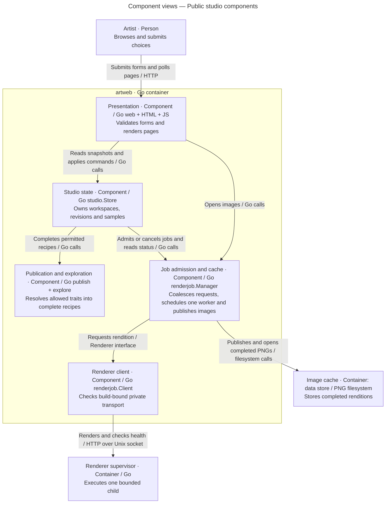
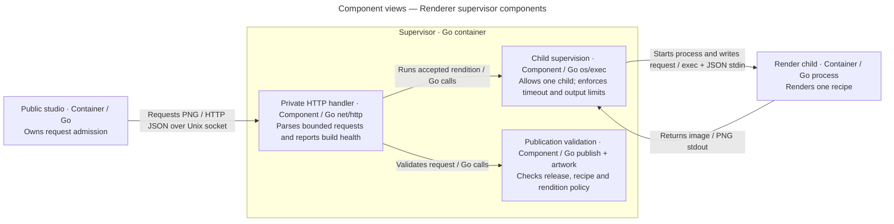
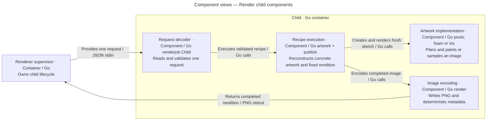
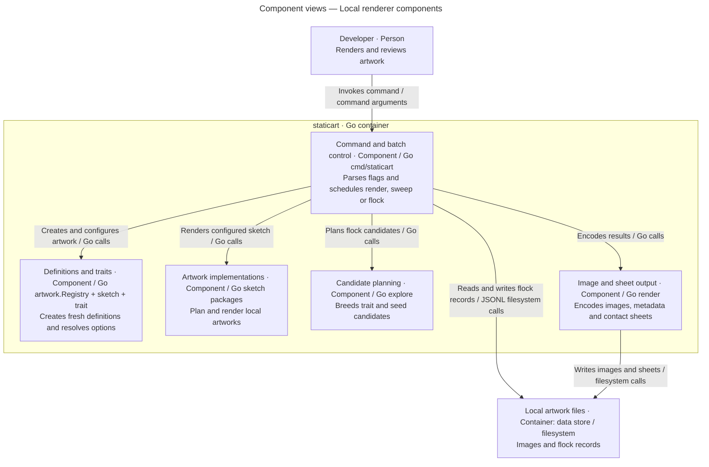

# Component views

Each diagram below decomposes one container from the [container view](containers.md). Audience: developers. Components are coherent interfaces inside a process; source package names locate their implementations.

## Public studio components

Scope: the `artweb` container.

Key: the enclosing box is one container. Inside boxes are Go components; outside boxes are a person, another container and a store. Arrows are directional calls/requests, labeled with their implementation mechanism. Layout has no semantic meaning.

[cmd/artweb](../../cmd/artweb/main.go) constructs dependencies, configures listeners, adds structured HTTP logging and handles shutdown. [web](../../internal/web/web.go) owns host, origin, form and CSRF checks; [studio](../../internal/studio/studio.go) owns navigation and command semantics; [publish](../../internal/publish/catalog.go) owns the public allowlist; [explore](../../internal/explore/explore.go) proposes deterministic candidates; [Manager](../../internal/renderjob/manager.go) is the only queue. Embedded templates and assets are presentation implementation, not independent backend services.

## Renderer supervisor components

Scope: the `artrender` supervisor container.

Key: the enclosing box is the supervisor process. Typed internal boxes are components; external boxes are containers. Arrows name directional interactions and protocols. The child is outside the supervisor boundary because it is a separate process.

[cmd/artrender](../../cmd/artrender/main.go) creates the private socket and handles signals. [protocol.go](../../internal/renderjob/protocol.go) implements handler, validation and supervision. It also contains the child entry function and client code compiled into other containers. A shared source file does not imply shared runtime memory.

## Render child components

Scope: one `artrender --child` process.

Key: one process boundary encloses Go components. The external box is the supervising container. Arrows name call or pipe direction; placement is layout only. [Child and transport](../../internal/renderjob/protocol.go), [recipe rendering](../../internal/artwork/recipe.go) and [materials](../reference/materials.md) establish these responsibilities.

## Local renderer components

Scope: the `staticart` container.

Key: one CLI process encloses Go components. Outside boxes identify the person and local store. Arrows describe calls or file operations. Source: [command](../../cmd/staticart/main.go), [sweep](../../cmd/staticart/sweep.go), [flock](../../cmd/staticart/flock.go), [exploration](../../internal/explore/explore.go). The [package map](../reference/packages.md) details shared mechanisms without giving each leaf its own C4 box.
