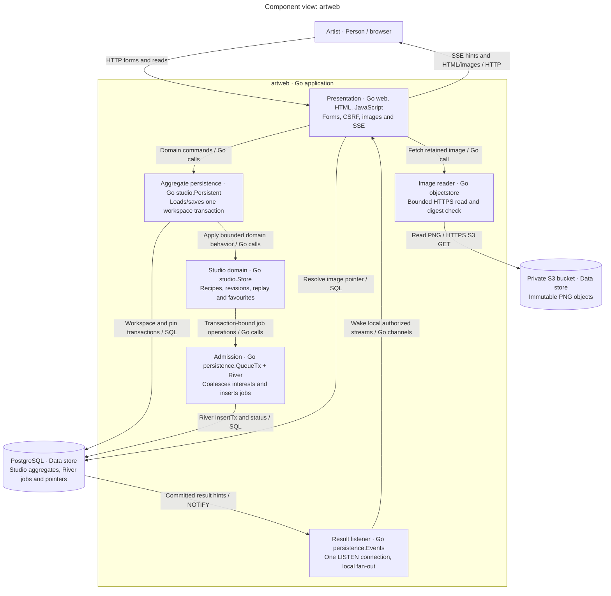
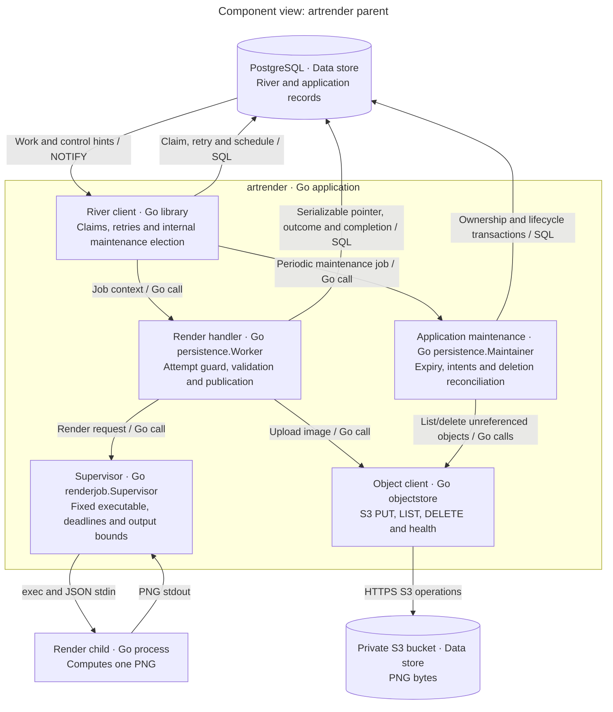
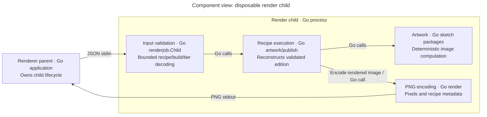
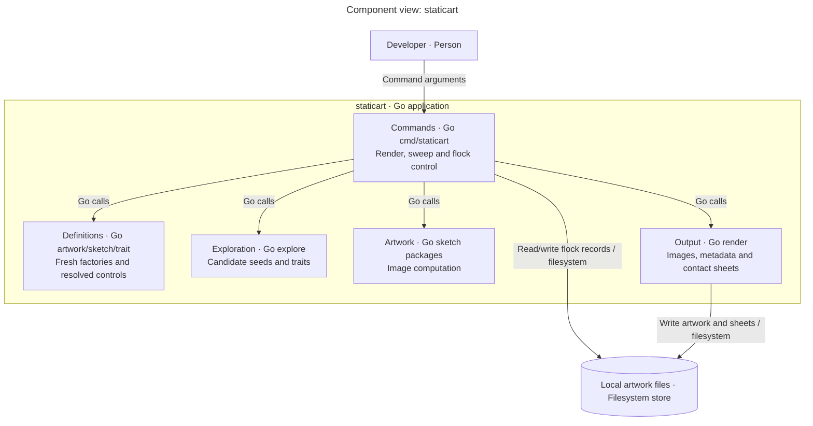

# Component views

Each diagram decomposes one application/process from the [container view](containers.md). Audience: developers. Components are in-process responsibilities, not additional Docker services.

## Public studio components

Scope: `artweb`.

Key: the enclosing box is one application; inside boxes are components, outside boxes are a person and stores. Arrows identify directional calls/transports. Web does not call a renderer or execute jobs. River's web client is insert-only.

[web](../../internal/web/web.go) binds request context to [studio.Persistent](../../internal/studio/persistent.go). It loads one bounded aggregate and invokes the existing [studio domain](../../internal/studio/studio.go) with a [QueueTx](../../internal/persistence/queue.go) sharing that transaction. Navigation, replay and job admission commit together. The legacy in-memory Manager and socket client remain for existing unit tests; production commands do not instantiate them.

Private admin HTTP also exposes a read-only [monitor snapshot](../../internal/persistence/monitor.go), consumed by artctl rather than the public browser. Web and renderer write boot-specific presence records; enqueue stores producer metadata. The [host-side terminal helper](../../deploy/scripts/watch.py) resolves Docker names, without adding a monitoring container or application access to Docker.

Both runtime services load the validated [limit policy](../../internal/limits/policy.go) at startup. Private [load timing queries](../../internal/persistence/loadstats.go) let the operator's k6 launcher collect server evidence separately from public HTTP requests; no load generator gets database credentials. Image delivery uses a [bounded byte/reader reservation](../../internal/web/image_budget.go) before S3 fetch and through response writing.

## Renderer service components

Scope: the `artrender` parent process.

Key: the enclosing box is the parent process. River maintenance is library code inside that process, not another service. The separate child shares its Docker network/resource boundary. All renderers consume independently; one River client is elected for internal queue maintenance.

[Worker](../../internal/persistence/worker.go) verifies canonical identity and fences publication using River attempt state and application generation/epoch. [Supervisor](../../internal/renderjob/protocol.go) kills/reaps child processes on deadline/output overflow. [Maintainer](../../internal/persistence/maintenance.go) performs application cleanup as River jobs, separately from River's own scheduler/rescuer/cleaner.

## Render child components

Scope: one `artrender --child` process.

Key: internal boxes are components of one process; parent is an external application. Pipes carry requests/results. The child does not use River or S3 credentials in its input/environment, but same-container execution is not a sandbox for hostile code. Source: [child](../../internal/renderjob/protocol.go), [recipe](../../internal/artwork/recipe.go), [render](../../internal/render/meta.go).

## Local renderer components

Scope: `staticart`, independent of PostgreSQL and S3.

Key: components are enclosed in one CLI application; person/store are outside. Arrows identify calls/file operations. Sources: [CLI](../../cmd/staticart/main.go), [flock](../../cmd/staticart/flock.go), [explore](../../internal/explore/explore.go), [package map](../reference/packages.md).
