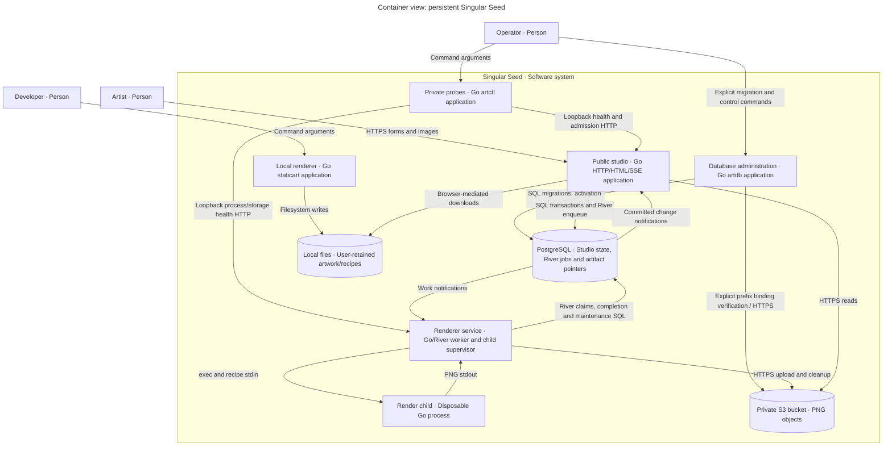

# Container view: Singular Seed

Scope: logical applications and stores. Audience: developers/operators. Docker placement is in [deployment](deployment.md).

Key: person, process/application and store types are explicit. Arrows name directional interactions. No direct web-renderer communication exists. The child is a separate process inside the renderer Docker container, sharing its network/resources.

- [artweb](../../cmd/artweb/main.go) owns presentation and insert-only River use; [persistent studio](../../internal/studio/persistent.go) saves domain state and jobs atomically.
- [artrender](../../cmd/artrender/main.go) consumes River, supervises one child and uploads results. River internally elects one started client for queue maintenance; no coordinator container.
- [PostgreSQL](../../internal/persistence/schema.sql) owns anonymous identities, navigation aggregates, requests/interests, pointers, upload intents, controls and rate buckets. River owns its own execution/history/leadership tables.
- [Object store](../../internal/objectstore/store.go) holds private PNG bytes. SQL contains keys/digests/sizes, never images.
- [artctl](../../cmd/artctl/main.go) probes private HTTP; [artdb](../../cmd/artdb/main.go) performs explicit migrations and release/queue control.
- [staticart](../../cmd/staticart/main.go) compiles artwork libraries and requires neither database nor bucket.

See [components](components.md), [runtime](runtime.md), [data](../reference/data.md) and [persistence operations](../operations/persistence.md).
