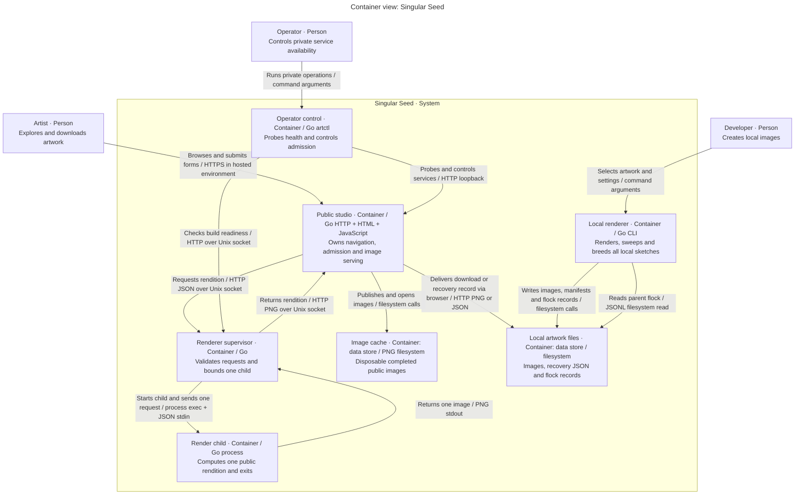

# Container view: Singular Seed

Scope: applications and data stores inside the Singular Seed software system. Audience: developers and operators. C4 containers are logical runtime units; Docker placement is in [deployment](deployment.md).

Key: typed boxes are persons, applications or stores. The enclosing box is the software system boundary. Each arrow names a directional interaction and transport. Box size and color carry no extra meaning. The browser mediates downloads into the artist's filesystem; the server does not write the user's disk directly.

## Responsibility and state

| Container | Entry point or ownership | State and lifetime |
| --- | --- | --- |
| Public studio | [artweb](../../cmd/artweb/main.go) | Workspaces, revisions, favourites, rate buckets and sole render queue in memory; one process |
| Renderer supervisor | [artrender](../../cmd/artrender/main.go) | Unix listener and one active-child flag; no queue or image cache |
| Render child | [Child](../../internal/renderjob/protocol.go) via `artrender --child` | One bounded request, fresh sketch and image; exits after output |
| Image cache | [Manager](../../internal/renderjob/manager.go) | Bounded PNG directory, reconciled on web startup |
| Operator control | [artctl](../../cmd/artctl/main.go) | One private command, run inside the appropriate service container |
| Local renderer | [staticart](../../cmd/staticart/main.go) | One command; directly compiles and calls artwork code |
| Local artwork files | CLI output and browser downloads | User-retained files; no automatic service backup or account association |

The studio's server-rendered pages and browser enhancement code form one application, following the [model convention](model.md). No browser local-storage database exists. Recovery is explicit JSON export/import. `artctl` is a separate operator command used against private listeners, including Compose health checks; its process runs inside the appropriate service container.

Both the local renderer and the render child compile artwork libraries. The local renderer does not call the public supervisor. The web process resolves public recipes but never executes their rasterization. No containers communicate with a database or broker.

See [components](components.md) for internal ownership, [data](../reference/data.md) for persistence and [runtime](runtime.md) for ordered interactions.
