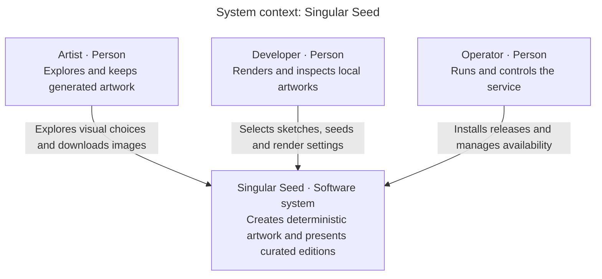

# System context: Singular Seed

Scope: one software system. Audience: readers, artists, developers and operators.

Key: boxes identify people or the software system; arrows describe a person's interaction with the system. Placement has no architectural meaning.

## Boundary and purpose

The artist explores Pools, Foam and Iris without an account. The developer can render all registered local sketches, inspect traits, sweep settings and breed candidate flocks. The operator installs immutable releases and can suspend generation while keeping existing pages and images available.

The artwork engine does not contact external software systems to generate an image. Palettes and catalogue images are included in the source/binaries. Caddy, certificate issuance and the cloud host are described in the [deployment view](deployment.md); they are hosting concerns rather than artwork business dependencies.

## Evidence and next view

The boundary follows [local command dispatch](../../cmd/staticart/main.go), [public catalogue](../../internal/publish/catalog.go), [web routes](../../internal/web/web.go) and [private control command](../../cmd/artctl/main.go). Zoom into [containers](containers.md) for applications and data stores.
