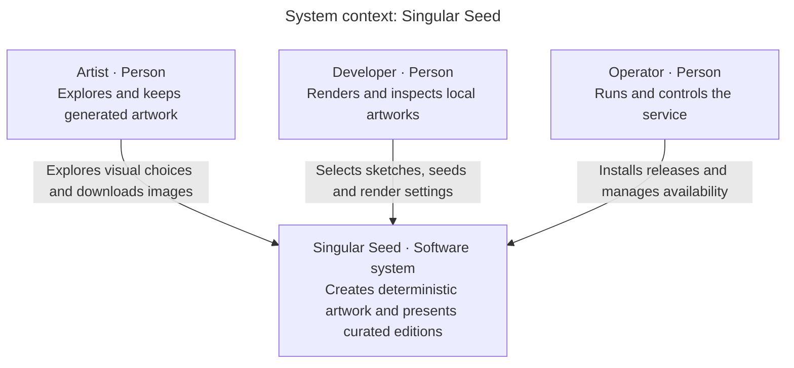

# System context: Singular Seed

Scope: one software system. Audience: readers, artists, developers and operators.

Key: boxes identify people or the software system; arrows describe a person's interaction with the system. Placement has no architectural meaning.

## Boundary and purpose

The artist explores Pools, Foam and Iris without an account and returns to retained favourites using the same browser capability cookie. The developer renders local sketches, inspects traits and breeds candidate flocks. The operator installs releases, bootstraps private persistent storage and can suspend new generation while retained pages/images remain available.

The artwork computation itself needs no external API: palettes and catalogue images are embedded. The studio does require database and image storage for durable operation. Its application-owned stores appear in the [container view](containers.md); their PostgreSQL/managed-bucket hosting, Caddy and certificate infrastructure appear in [deployment](deployment.md). The CLI does not require those services.

## Evidence and next view

The boundary follows [local command dispatch](../../cmd/staticart/main.go), [public catalogue](../../internal/publish/catalog.go), [web routes](../../internal/web/web.go) and [private control command](../../cmd/artctl/main.go). Zoom into [containers](containers.md) for applications and data stores.
