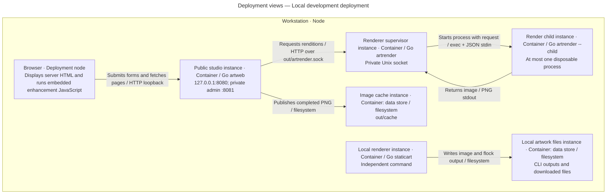
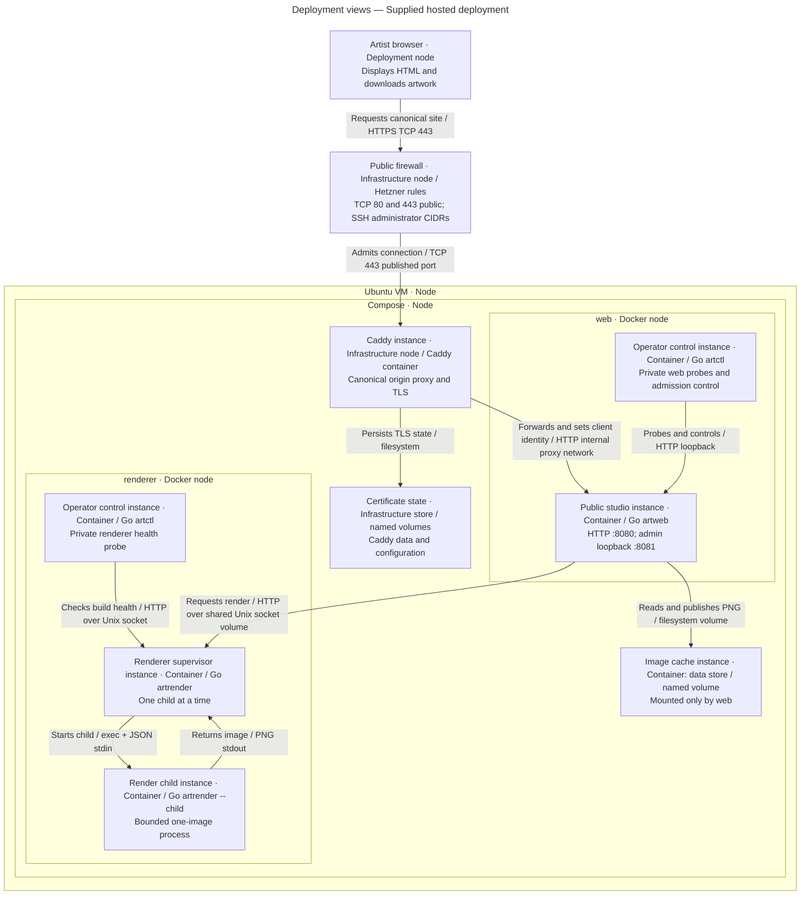

# Deployment views

These views describe executable environments provided by the repository. They do not establish the current state of a remote host. Audience: developers and operators.

## Local development deployment

Key: enclosing boxes are deployment nodes; typed inner boxes are application/store instances except the explicitly labeled browser execution environment. Arrows are directional communication with protocols. Layout has no extra meaning. [Local commands](../guides/getting-started.md) run these processes directly; [local Compose](../operations/running.md) rehearses Linux isolation instead.

## Supplied hosted deployment

Key: outer enclosures are infrastructure/deployment nodes; application and store instances are explicitly typed. Caddy/firewall/certificate stores are supporting infrastructure, not artwork components. Arrows identify traffic or file operations and protocol. The diagram shows the configured HTTPS hostname mode. With no hostname Terraform configures HTTP at the assigned IPv4 instead; there is then no HTTPS guarantee for user traffic.

The Compose proxy subnet defaults to `172.30.80.0/29`: Caddy `.2`, web `.3`. Only Caddy publishes host ports. The web process trusts one configured proxy address and reads its overwritten `X-Art-Client` header. The renderer has `network_mode: none`, a writable socket volume and no cache mount. The web socket mount is read-only. Both use a shared group to access the socket; child processes inherit the renderer container's resource and network limits.

Resource limits are Caddy 256 MiB / 0.5 CPU, web 384 MiB / 0.5 CPU, renderer 2 GiB / 1.5 CPU; all have 64 process IDs, dropped capabilities, no-new-privileges, read-only roots and bounded temporary filesystems. The application image contains `artweb`, `artrender` and `artctl`; the same image runs with different entry points/users. Caddy has persistent certificate/config volumes. A host reboot uses Docker's restart policy. There is one web queue; the activation script stops old web/renderer instances before replacement.

## Provisioning and release placement

Terraform defines the VM, public IPv4/IPv6, cloud firewall and SSH key. Cloud-init installs pinned Docker tooling and the host firewall. A local provisioning task uploads a checked release over SSH and activates it. Releases live under `/opt/art/releases/<commit>`, `/opt/art/current` identifies the active release, and `/etc/art/operator.env` supplies the runtime origin/network configuration. Terraform state is local to the operator workspace.

Source: [Compose](../../deploy/compose.yaml), [Dockerfile](../../deploy/Dockerfile), [Caddy configuration](../../deploy/caddy/Caddyfile), [Terraform](../../deploy/terraform/main.tf), [cloud-init](../../deploy/cloud-init/user-data.yaml), [activation](../../deploy/scripts/activate-release.sh). Read [operations](../operations/running.md), [release procedures](../operations/releases.md) and [provisioning](../operations/provisioning.md) before changing an environment.
