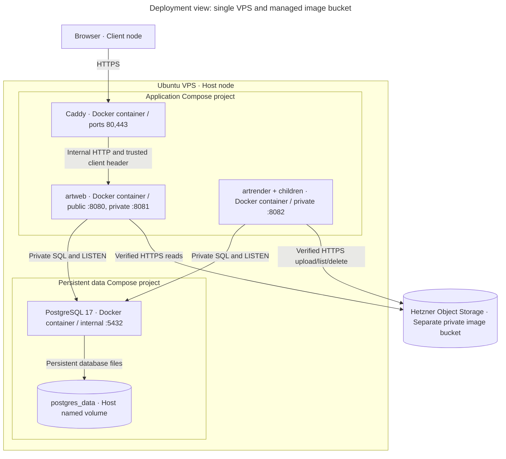

# Deployment views

Scope: repository-provided local and hosted runtime. This describes code, not a claim that a remote release is deployed.

Key: enclosures are deployment boundaries; typed boxes are service instances/stores. Arrows label transports. Only Caddy publishes application host ports. No direct web-renderer connection or socket volume exists.

The proxy subnet defaults to `172.30.80.0/29` (Caddy `.2`, web `.3`). Web trusts only Caddy's configured address. A separate internal database network connects data, web, renderer and one-shot administration. Web/renderer also have egress networks for the bucket. Render children share parent networking; fixed executable, deadlines, output caps and container restrictions remain.

Limits: edge 256 MiB/0.5 CPU, web 384 MiB/0.5 CPU, renderer 2 GiB/1.5 CPU including parent and child; app services drop capabilities, use non-root/read-only roots and bounded tmpfs/PIDs/logs. PostgreSQL has 512 MiB, 128 MiB shared memory, 64 MiB shared buffers and 40 maximum connections. Measure host headroom before increasing renderer replicas. River `MaxWorkers=1` is per container, not cluster-global.

Local `browser-server.sh`/`verify-compose.sh` add a pinned disposable S3 emulator in the data network, generate isolated secrets and publish only loopback Caddy ports. Go integration fixtures publish PostgreSQL/S3 on loopback 15439/19009. Production uses external managed storage and per-service credentials. See [persistence operations](../operations/persistence.md).

Terraform still owns VPS/firewall/IP/SSH; `deploy_application=false` permits bootstrap before application activation. Storage credentials and bucket provisioning are separate from cloud-init/state. `/etc/art/operator.env` holds origin/network settings; `/etc/art/storage.env` holds nonsecret bucket settings; `/etc/art/secrets/` holds protected credentials. Releases live at `/opt/art/releases/<commit>` with `/opt/art/current` selecting the application. Data volume lifetime is independent of release replacement, not of VPS destruction.

Sources: [application Compose](../../deploy/compose.yaml), [data Compose](../../deploy/compose.data.yaml), [admin Compose](../../deploy/compose.admin.yaml), [Terraform](../../deploy/terraform/main.tf), [Dockerfile](../../deploy/Dockerfile).
