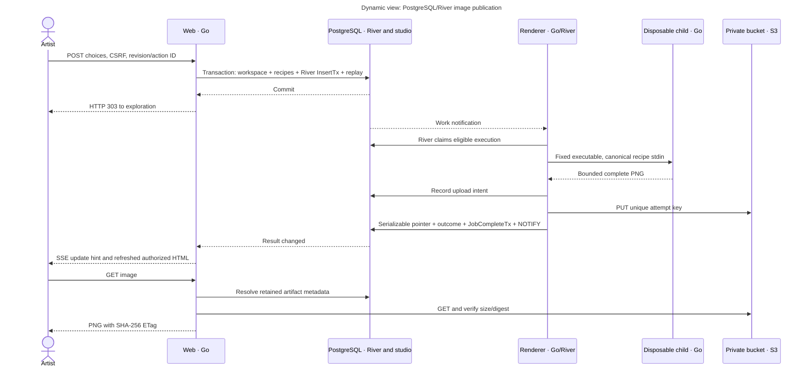

# Dynamic views: durable rendering

Scope: one successful four-image action and its asynchronous results. Audience: developers/operators.

Key: labeled participants are actor/applications/stores; arrows show temporal calls and replies. The renderer initially executes one child at a time. Notification loss affects promptness, not durability; listeners subscribe before reading snapshots and resynchronize after reconnect. Active SSE pages also reconcile periodically. No GET starts rendering.

## Failures and retries

River rescues abandoned executions and schedules bounded retries. Deterministic render errors are terminal, while transient database/object failures can retry. At-least-once execution can compute twice; unique object keys and serializable current-attempt/generation/epoch checks prevent stale publication. A failed SQL commit after upload leaves an intent for orphan cleanup. Cancellation removes one workspace's interest; last-interest cancellation invalidates publication and asks River to cancel its context.

Web can be stopped while renderer finishes; completed pointers and job state require no later web callback. Database errors return 503 rather than expired session/image status. Confirmed absent images return 410. See [worker](../../internal/persistence/worker.go), [queue](../../internal/persistence/queue.go) and [maintenance](../../internal/persistence/maintenance.go).

## Similarity, favourites and transfer

Similarity preserves the selected sample's visual family/palette and records fresh concrete seeds before admission. Downloads are explicit 1200×1200 render requests. Favourite preview pins survive ordinary cache expiry and application restart while the anonymous owner is unexpired.

The existing export/import routes transfer recipe JSON, not cookies or accounts. Restoring recipes does not silently enqueue all images; explicit image actions are still required. Cookie loss means loss of access to that anonymous identity; recipe export/import remains the manual transfer mechanism. See [HTTP reference](../reference/http-api.md).
