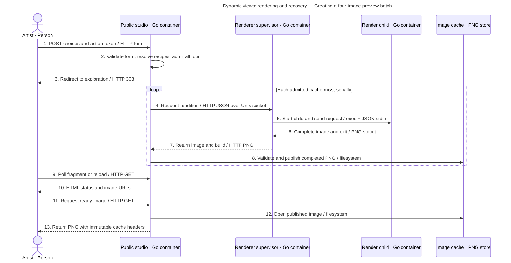
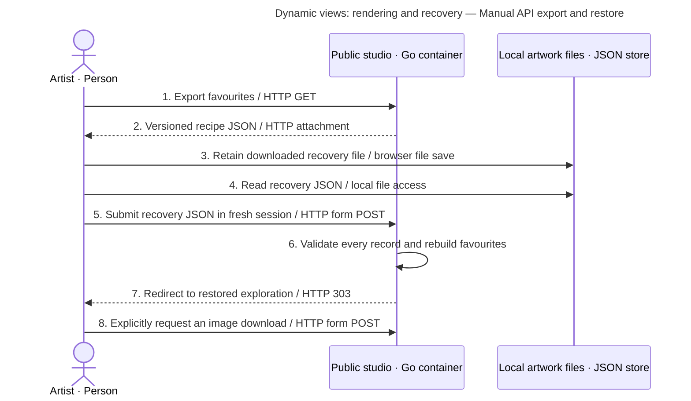

# Dynamic views: rendering and recovery

## Creating a four-image preview batch

Scope: one successful studio entry with a cache miss. Audience: developers and operators. Participants are containers or the artist from the [static model](containers.md).

Key: participant labels state person/container/store types and technology. Solid arrows are requests or actions; dashed arrows are replies. Numbers establish ordering; the loop is serial work. HTML polling does not create jobs.

Admission may reuse completed or in-flight identities, so a hit skips execution. The queue accepts all four interests or none. The supervisor has no second queue. Each child has a deadline and bounded output; a failed child produces a failed job, never a partial published PNG. Cancellation releases one owner's interest and stops shared work only when no subscribers remain. See [Manager](../../internal/renderjob/manager.go), [Supervisor](../../internal/renderjob/protocol.go), [studio admission](../../internal/studio/studio.go).

## Similar images and downloads

A similarity request selects one existing sample. The studio pins its complete traits and palette and chooses fresh seeds for four new compositions. This is stricter than the generic candidate planner's mixed family policy: all four public results retain the selected visual family. Favourites remain immutable recipes when current choices change.

A download is a separate explicit POST. It admits the same recipe at the server-owned 1200×1200 rendition; a ready download does not need another render. The browser enhancement clicks the ready download link after polling. Without JavaScript the artist prepares the image, refreshes and uses the available link. A GET of an expired image returns 410; it never regenerates that image.

## Manual API export and restore

The HTTP routes support the sequence below, but the current templates do not provide an export/restore form. Export is a manually visited URL; restore requires a form-capable technical client.

Key: participants are the artist, web container and user-owned file store. Solid arrows are requests/actions; dashed arrows are replies. Numbers show sequence. Restore allocates navigation and recipes only; step 8 is what requests rendering. Source: [Recovery and Restore](../../internal/studio/studio.go), [web export/restore routes](../../internal/web/web.go).
