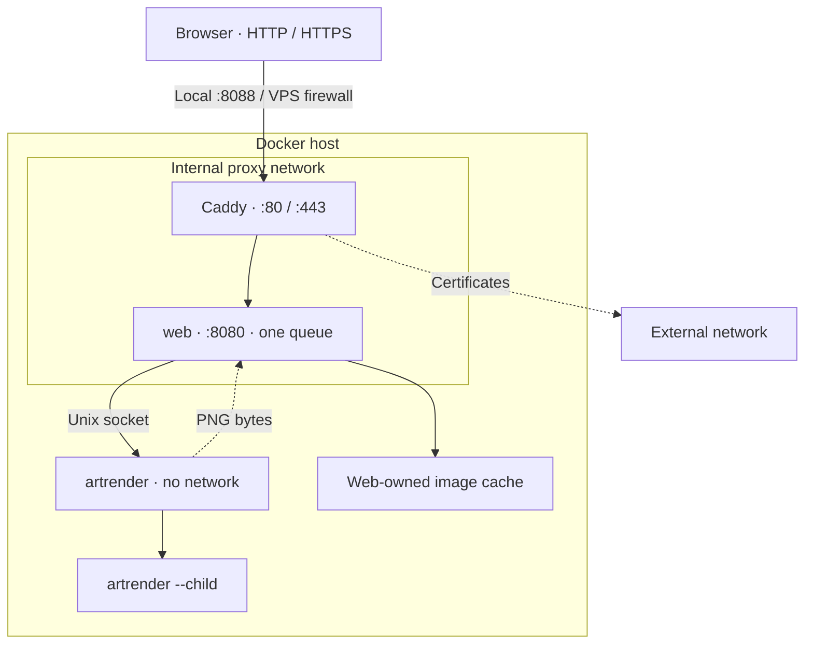
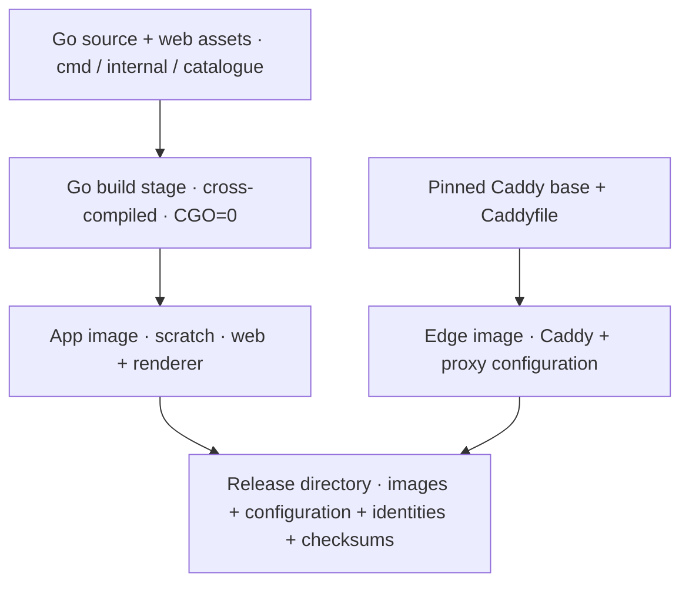
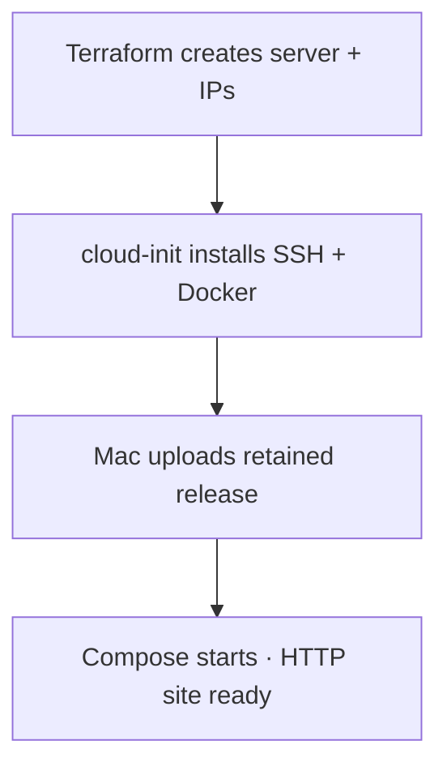
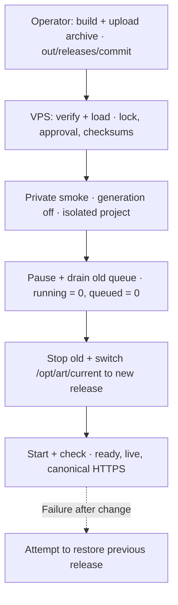

# How Singular Seed is set up.

> **Documentation format prototype.** Content transcribed from the existing
> HTML snapshot; this is not a fresh infrastructure status check.

The application, its local Docker stack, and the intended VPS
deployment—what each configuration file defines and how the pieces
connect.

- Local: 3 healthy containers · HTTP 200
- Runtime: Docker Compose
- VPS created · SSH recovery pending

Local status was checked on 10 September 2026 at
[localhost:8088](http://localhost:8088). This page is a snapshot, not a
live status display. The chosen public domain is `singularseed.art`.

## System overview

Singular Seed is the public studio alongside the local `staticart` CLI.
It serves Go-rendered HTML with htmx enhancements and a curated artwork
catalogue. The web process owns temporary visitor state, the single
bounded job queue, and the generated-image cache. Rendering runs in a
separate container.

*Three services use two images: web and renderer share the app image;
Caddy uses the edge image. The child is a process inside renderer. Caddy
also joins an external network for certificate-related traffic.*

Only Caddy exposes host ports. Web administration stays at
`127.0.0.1:8081` inside the web container. Caddy’s admin interface is
also private. The renderer has no network and receives work through
`/run/art/renderer.sock`. Neither application container receives the
Docker control socket or cloud credentials. A stopped renderer can fail
readiness while the gallery remains available.

Defined in [deploy/compose.yaml](../../../deploy/compose.yaml),
[Caddyfile](../../../deploy/caddy/Caddyfile),
[artweb](../../../cmd/artweb/main.go) and [the renderer
protocol](../../../internal/renderjob/protocol.go).

## What is defined where—and why

| File | Defines | Why it lives here |
|----|----|----|
| [`deploy/terraform/main.tf`](../../../deploy/terraform/main.tf) | Hetzner server, primary IPs, cloud firewall, SSH public key, provider versions, backend type. | Cloud resources have a lifecycle separate from application releases. |
| [`terraform.tfvars.example`](../../../deploy/terraform/terraform.tfvars.example) | Examples for production inputs. Real operator files stay outside Git. | Set the server name, administrator access ranges and release. |
| [`deploy/cloud-init/user-data.yaml`](../../../deploy/cloud-init/user-data.yaml) | First-boot user, SSH policy, OS packages, log retention and reboot policy. | Prepares the operating system when Terraform creates the host. |
| [`bootstrap-host.sh`](../../../deploy/scripts/bootstrap-host.sh) | Pinned Docker Engine, containerd, Buildx and Compose installation. | Cloud-init runs it automatically to install Docker and enable UFW host rules. |
| [`deploy/Dockerfile`](../../../deploy/Dockerfile) | Build stages, Go binaries, base-image digests, image users and default entrypoints. | Packages software. Machine-specific addresses and limits belong elsewhere. |
| [`deploy/compose.yaml`](../../../deploy/compose.yaml) | Service roles, users, networks, port mappings, volumes, environment variables, limits and health checks. | Runs the same topology locally and on the VPS using different inputs. |
| [`deploy/local.env`](../../../deploy/local.env) / [`operator.env.example`](../../../deploy/operator.env.example) | Local inputs and a template for the host’s `/etc/art/operator.env`. | Selects domain, origin, bind addresses and environment without rewriting Compose. |
| [`deploy/caddy/Caddyfile`](../../../deploy/caddy/Caddyfile) | Site address, proxy destination, header handling, body/time limits and private-path rejection. | HTTP/TLS edge behaviour; baked into the edge image. |
| [`build-release.sh`](../../../deploy/scripts/build-release.sh) / [`activate-release.sh`](../../../deploy/scripts/activate-release.sh) | Release packaging and the smoke/drain/replace/rollback sequence. | Coordinates a change of running software; Terraform now invokes these scripts after provisioning. |
| [`.github/workflows/check.yml`](../../../.github/workflows/check.yml) | Automated Go, browser, packaging, infrastructure and Compose checks. | Verifies commits. It does not deploy to a host. |

## Local Docker and Compose setup

The local project is `art-local`. Docker runs Linux containers in a VM
on macOS. The checked stack uses Colima. There are no source bind mounts
or automatic rebuilds: Go code, templates, browser assets and the
Caddyfile are included in images.

Repository root · build and start

    docker compose -p art-local --env-file deploy/local.env -f deploy/compose.yaml build web caddy
    docker compose -p art-local --env-file deploy/local.env -f deploy/compose.yaml up -d --no-build --wait

Open <http://localhost:8088>. The local site explicitly uses HTTP, so
Caddy does not request certificates. After changing packaged files,
repeat build and up; a restart alone does not build changed source.

### Local status, logs and shutdown commands

    docker compose -p art-local --env-file deploy/local.env -f deploy/compose.yaml ps
    docker compose -p art-local --env-file deploy/local.env -f deploy/compose.yaml logs --tail 100 web renderer
    docker compose -p art-local --env-file deploy/local.env -f deploy/compose.yaml exec -T web /app/artctl ready
    # Stop and remove this project's containers and networks; retain volumes.
    docker compose -p art-local --env-file deploy/local.env -f deploy/compose.yaml down

| Setting | Local | Target VPS |
|----|----|----|
| Compose definition | `deploy/compose.yaml`; host uses its retained release copy. | `deploy/compose.yaml`; host uses its retained release copy. |
| Project / images | `art-local`; development image tags, local build platform. | `singular-seed`; exact Linux amd64 image IDs. |
| Environment input | `deploy/local.env` | `/etc/art/operator.env` plus release `images.env` |
| Site / browser origin | `http://localhost` / `http://localhost:8088` | Approved hostname / its full `https://…` origin |
| Published addresses | Loopback IPv4/IPv6; host ports 8088 and 8443. | Public IPv4/IPv6; host ports 80 and 443, behind firewall rules. |
| Container addressing | Proxy network defaults to `172.30.80.0/29`: Caddy `.2`, web `.3`. Renderer has no network. | Proxy network defaults to `172.30.80.0/29`: Caddy `.2`, web `.3`. Renderer has no network. |

The env file supplies values for Compose substitution; each service’s
`environment:` block determines what enters that container.
`ART_TRUSTED_PROXY` follows the configured Caddy IP. See [the local
runbook](../../../deploy/README.md#local-rehearsal).

## Image builds and retained releases

*The app image contains `artweb`, `artrender`, `artctl` and `staticart`.
The compiler and browser-test dependencies stay out of the final app
image.*

[Dockerfile](../../../deploy/Dockerfile) pins Go 1.26.8 and Caddy 2.11.4
by digest. [.dockerignore](../../../.dockerignore) limits build inputs.
`make build` only builds the native art CLI; the deployment release is
built with:

    # Repository root; requires a clean committed checkout and Docker.
    deploy/scripts/build-release.sh

Output: `out/releases/<full-commit>/`. The script refuses to overwrite
an existing release directory. It always targets `linux/amd64`; builds
on Apple Silicon cross-compile the Go binaries, and local execution of
these release images uses emulation. Local development builds remain
native ARM; neither is a VPS performance measurement.

| Release file | Purpose |
|----|----|
| `images.tar` | App and edge images, saved for transport without a registry. |
| `images.env` | `ART_APP_IMAGE`, `ART_EDGE_IMAGE` as exact `sha256:…` image IDs; `ART_REVISION` as the source commit. |
| `deploy/` | The matching version of Compose, configuration and release scripts. |
| `manifest.txt` / `catalogue.json` | Source/tool/edition metadata and the public catalogue manifest. |
| `SHA256SUMS` | Checksums of the retained files. Trusted delivery is still required. |

CI runs `make check`, race and vulnerability checks, browser tests,
release builds, activation tests, Terraform validation and real Compose
checks. It currently has no archive-upload or host-deployment step. See
[check.yml](../../../.github/workflows/check.yml).

## VPS provisioning

Terraform creates the cloud objects and waits for a usable staging app.
The target is one Hetzner `cx23` (x86-64), Ubuntu 24.04, in `nbg1`, with
backups enabled. Staging opens over **HTTP at the server IPv4**; no DNS
is needed.

| File / input | Responsibility |
|----|----|
| `deploy/terraform/main.tf` | Server, IPs, SSH key, cloud firewall and the application deployment task. Pins Terraform 1.14.9 and hcloud 1.68.0. |
| `terraform.tfvars` | Private local inputs: name, location, administrator CIDRs and SSH paths. `release_directory` selects an existing release archive directory. Empty `hostname` means HTTP at IPv4; a hostname enables HTTPS and needs DNS configured separately. |
| `protect_server` | Defaults to false. Replacing only the server retains the separately managed IPs. Full destruction removes the IPs too; neither operation preserves server-local Docker volumes. |
| `cloud-init/user-data.yaml` | Creates the operator account, configures SSH and installs the host scripts. Explicit `primary_group: operator` fixes the Ubuntu account-creation failure. Changes replace the server. |
| `bootstrap-host.sh` | Installs the pinned Docker stack and enables UFW with administrator SSH and HTTP/HTTPS rules. The Hetzner firewall protects public traffic including Docker forwarding; UFW protects host INPUT only. |
| [`provision-app.py`](../../../deploy/scripts/provision-app.py) | Runs on your Mac during apply: verifies the selected release, waits for SSH and cloud-init, uploads the archive and starts installation. A failed deployment task retries independently of server creation. |
| [`install-release.sh`](../../../deploy/scripts/install-release.sh) | Runs on the VPS: extracts the verified release, writes `/etc/art/operator.env`, records the production apply selection and invokes the existing activation scripts. |
| `deploy/terraform/terraform.tfstate` | Local resource inventory, ignored by Git. Retain and independently back it up while infrastructure exists. Use one operator checkout; do not start another state over existing resources. No object storage is needed. |

*One apply connects cloud provisioning to the existing release
activation process.*

Status, 11 September: the production application was previously deployed
over HTTP at its assigned IPv4. A fresh local-state destroy/apply
rehearsal is pending, followed by DNS and HTTPS setup. This guide does
not verify current live infrastructure.

### Provisioning commands · your machine

Use the private variable file, current administrator CIDRs and cloud API
token. For an existing checkout, follow the [one-time transition
instructions](../../../deploy/terraform/README.md) after destroying the
old infrastructure. Build once from a clean committed checkout; reuse
that directory on later rebuilds. If the SSH identity has a passphrase,
load it with `ssh-add ~/.ssh/id_ed25519` first.

    deploy/scripts/build-release.sh
    export TF_VAR_release_directory="$PWD/out/releases/$(git rev-parse HEAD)"
    terraform -chdir=deploy/terraform init
    terraform -chdir=deploy/terraform plan -out=infra.tfplan
    terraform -chdir=deploy/terraform apply infra.tfplan

Apply stays connected until the app is ready and returns `site_url`. To
replace just the server, add `-replace=hcloud_server.web` to plan. To
destroy everything in this root, run
`terraform -chdir=deploy/terraform destroy`, then apply again. Full
destruction may change the IP. Cached artwork, TLS data and other
server-local data are disposable; retain important artifacts elsewhere.

Cloud credentials stay on your machine. SSH uses the identity locally
and trusts the new host key on first connection, recording it by server
ID in `out/provision/known_hosts`. A failed upload or activation needs a
fresh plan/apply; it does not require another server rebuild.

Details and one-time migration: [Terraform
workflow](../../../deploy/terraform/README.md). Subsequent releases can
use the same apply flow or the manual activation process below.

## VPS runtime configuration

The host keeps its environment in root-owned `/etc/art/operator.env`,
mode `0600`. Start from
[operator.env.example](../../../deploy/operator.env.example); that
example is production-oriented, so change both environment and hostname
for staging.

| Input | What it controls | Production example |
|----|----|----|
| `ART_ENVIRONMENT` | Which approval record activation requires. The automated installer derives it from Terraform’s environment input. | `production` |
| `ART_DOMAIN` | Caddy’s site address and automatic HTTPS behaviour. | `singularseed.art` |
| `ART_ORIGIN` | The app’s exact canonical browser origin, including scheme and any nonstandard port. | `https://singularseed.art` |
| `ART_BIND` / `ART_BIND6` | Host interfaces on which Caddy’s ports are published. | `0.0.0.0` / `[::]` |
| `ART_HTTP_PORT` / `ART_HTTPS_PORT` | Host port mappings; Caddy listens on 80/443 inside its container. | `80` / `443` |
| `ART_PROXY_NET` | Private IPv4 prefix used by both the Compose network and trusted Caddy address. | `172.30.80` |
| `ART_LOG_LEVEL` | Application log verbosity. Debug is useful temporarily when diagnosing a request. | `info` |

`compose-release.sh` selects the fixed project `singular-seed`, loads
the operator file, then loads the release’s `images.env`. The latter
supplies the exact image IDs. The wrapper removes inherited
image/revision environment variables so they cannot silently replace
those IDs.

### Service limits and storage

| Service | Memory / CPU ceiling | Mounts and identity |
|----|----|----|
| Caddy | 256 MiB / 0.5 CPU | `caddy_data:/data`, `caddy_config:/config`; user `10003:10003`. |
| Web | 384 MiB / 0.5 CPU | Socket directory read-only, image cache writable; user `10001:10000`. |
| Renderer | 2 GiB / 1.5 CPU, including child processes | Socket directory writable; user `10002:10000`; no network. |

All services have a read-only root filesystem, dropped capabilities, no
additional swap budget, 64-task limit, temporary `/tmp`, bounded local
logs and `restart: unless-stopped`. These are configuration ceilings,
not measured VPS capacity. Web and renderer share group access to the
Unix socket; a read-only directory mount still permits socket
communication.

The [Caddyfile](../../../deploy/caddy/Caddyfile) proxies to `web:8080`,
overwrites `X-Art-Client`, removes visitor forwarding headers and
rejects public admin paths such as `/metrics` and `/ready`. TLS
account/certificate state is retained in Caddy’s volumes.

## Deployment and rollback

The operator builds a committed release and uploads its complete
directory over trusted SSH to `/opt/art/releases/<full-commit>`. The
target host loads prebuilt images; it does not compile the application.
Release activation runs as root.

*The fixed project keeps one admission queue. A private smoke candidate
has generation disabled. A normal update briefly restarts the app and
loses in-memory workspaces.*

On the prepared VPS · after upload and approval

    sudo /opt/art/releases/FULL_COMMIT/deploy/scripts/activate-release.sh FULL_COMMIT

Replace `FULL_COMMIT` in both places with the same retained 40-character
commit ID. Activation requires `/etc/art/staging-approved` or
`/etc/art/launch-approved` according to `ART_ENVIRONMENT`. These records
reflect the owner’s actual approval; the scripts do not create them.

| Failure point | Script response |
|----|----|
| Validation or private smoke | Stops before changing the current application. |
| Drain timeout / missing metrics | Aborts replacement and attempts to reopen old admission. |
| Failure after replacement begins | Attempts to restore the previous current pointer, images and configuration, then checks readiness. Operator verification is still required. |
| Failed first installation | Removes candidate containers and the current pointer while preserving volumes; there is no previous release. |

**Manual rollback:** activate a retained previous release using the same
command and its commit ID. Keep its archives and images available. A
rollback restores software/configuration, not visitor state already lost
from memory.

Sequence:
[activate-release.sh](../../../deploy/scripts/activate-release.sh).
Private validation:
[smoke-release.sh](../../../deploy/scripts/smoke-release.sh). Host
command configuration:
[compose-release.sh](../../../deploy/scripts/compose-release.sh). An
incident generation kill switch needs separate handling because
failed-drain recovery attempts to enable generation again.

## Operations, state and recovery

### Host status, logs and private administration

Use the active release’s wrapper so all commands select the same project
and configuration.

    sudo /opt/art/current/deploy/scripts/compose-release.sh /opt/art/current ps
    sudo /opt/art/current/deploy/scripts/compose-release.sh /opt/art/current logs --tail 100 web renderer
    sudo /opt/art/current/deploy/scripts/compose-release.sh /opt/art/current exec -T web /app/artctl live
    sudo /opt/art/current/deploy/scripts/compose-release.sh /opt/art/current exec -T web /app/artctl ready
    sudo /opt/art/current/deploy/scripts/compose-release.sh /opt/art/current exec -T web /app/artctl metrics
    # Pause new render admission; use generation-on to resume.
    sudo /opt/art/current/deploy/scripts/compose-release.sh /opt/art/current exec -T web /app/artctl generation-off

`live` checks web service availability; `ready` also requires a
compatible renderer. Docker health checks do not render images. An
unhealthy status alone does not restart a container. Correlate `job=`
values across web and renderer logs when a render fails.

| Data / location | Retention and recovery |
|----|----|
| Web memory | Workspaces, favourites and jobs are temporary and lost when web restarts. No application database or durable-session promise. |
| `singular-seed_cache` | Generated-image cache; survives ordinary recreation but is disposable and bounded by the app. |
| `singular-seed_socket` | Runtime IPC endpoint; recreated as needed with services stopped. |
| `singular-seed_caddy_data` / `caddy_config` | Retain and independently back up TLS/account/configuration state. Restore with correct ownership while Caddy is stopped. |
| `/etc/art`, release archives, Terraform state and credentials | Independent encrypted recovery copies outside the VPS. Keep the previous working release and images required for retained artwork editions. |

Local volumes use the `art-local_` prefix. A volume surviving container
replacement is not a backup against host loss. Production
`down --volumes` deletes that project’s named data volumes.

### Other operational facts

- **Logs:** Docker’s local driver retains three 10 MiB files per
  service. Host journald is capped at 256 MiB/seven days. Monitor disk
  reserve, restart loops and certificate problems.
- **Updates:** base images and host packages are pinned. OS automatic
  reboot is disabled; runtime updates and maintenance reboots need an
  operator schedule.
- **Capacity:** one web queue and one active renderer job. Adding a
  second web replica creates another independent queue. Scaling needs an
  application state/admission design.
- **Recovery:** recover state access, rebuild the host, restore
  operator/TLS files, load a retained release and activate it. The
  proposed two-hour recovery objective is not yet demonstrated.
- **Still pending:** target amd64 capacity/OOM, reboot and dual-stack
  firewall verification, live TLS/renewal, local-state recovery,
  external alert recipient, and a measured second-machine recovery.

Full detail: [operations
runbook](../../../deploy/README.md#private-operations) and [current
launch gates](../../web/launch-gates.md). Local implementation and tests
do not establish these target-host results.

## Where to find more information

| Question | Start here |
|----|----|
| What is implemented and what is verified? | [Web implementation record](../../web/IMPLEMENTATION.md)—read the dated Compose update; earlier systemd/worktree entries are historical. |
| What remains before publication? | [Launch gates](../../web/launch-gates.md)—host proof, artwork approval, operator details and usage terms. |
| What is the intended visitor experience? | [Product and UX](../../web/product-and-ux.md), [interaction revision](../../web/ux-simplification.md). |
| Where are security boundaries specified? | [Security and operations](../../web/security-and-operations.md); [web architecture](../../web/architecture.md). |
| Where is the queue and child execution code? | [renderjob/manager.go](../../../internal/renderjob/manager.go) and [renderjob/protocol.go](../../../internal/renderjob/protocol.go). |
| Where are public artwork choices and visitor state? | [publish/catalog.go](../../../internal/publish/catalog.go), [studio/studio.go](../../../internal/studio/studio.go), [artwork/recipe.go](../../../internal/artwork/recipe.go). |
| How does the art engine work? | [Art architecture](../../ARCHITECTURE.md), [per-sketch specifications](../../sketches/), [domain vocabulary](../../../CONTEXT.md). |
| Why Docker Compose? | [ADR 0004](../../adr/0004-compose-runtime.md) records the chosen runtime. |

Links refer to files in this checkout. This Markdown prototype is the
content source; Mermaid diagrams render on GitHub. Run `make docs-prototype`
for the local browser edition. The original `index.html` remains for comparison.

Singular Seed system reference · 10 September 2026 · Configuration
baseline `b3e4a81` + CX23 configuration update. Runtime files and the
deployment runbook are the source of truth for subsequent changes.
