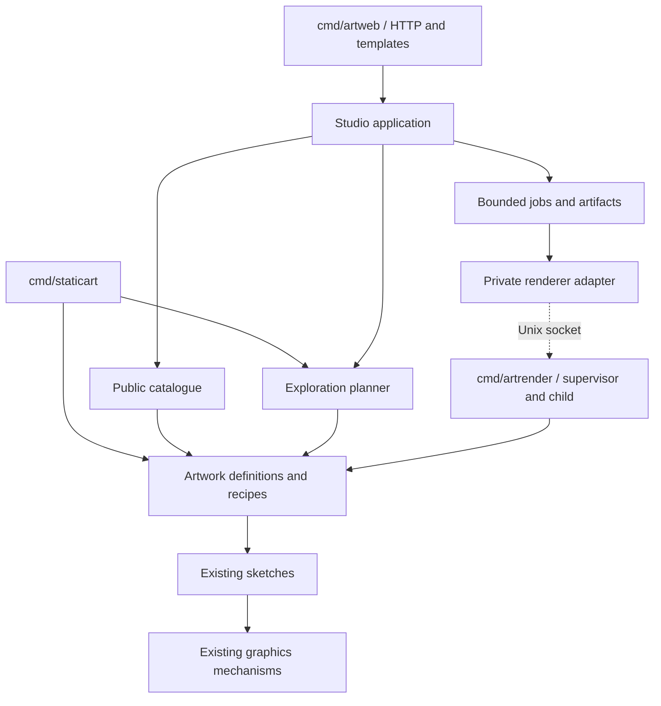

# Architecture for the public application

Status: proposed. Keep one repository and Go module, with separate local and
public entry points. The separation is by domain responsibility and resource
ownership, not by a requirement to create microservices or generic DDD layers.

## Ownership and dependency direction

The artwork engine defines what images mean and how to make them. Publication
defines what the public can explore. Exploration defines how a visitor's
choices lead to candidate recipes. Rendering delivery controls when work can
run and how completed images are retained. HTTP presents those capabilities.



Proposed initial file map, created incrementally:

```text
cmd/staticart/                 local CLI; existing flags and output workflow
cmd/artweb/                    web composition root, configuration, lifecycle
cmd/artrender/                 private supervisor + one-shot child execution
internal/artwork/              factories, canonical recipes, edition/config codecs
internal/explore/              pure sample/refinement planning
internal/publish/              explicit public catalogue and choice mappings
internal/studio/               exploration commands and ephemeral workspaces
internal/renderjob/            admission, queue, lifecycle, artifacts, renderer adapter
internal/web/                  handlers, view models, templates, embedded assets
internal/logging/              service-tagged slog setup and safe HTTP completion records
internal/sketch/<name>/        existing art policy + typed config where promoted
internal/{render,paint,...}/   existing mechanisms
web/catalog/                  reviewed example manifest and deliberate public assets
deploy/terraform/             cloud resources and backend configuration examples
deploy/cloud-init/            initial host bootstrap, no secrets
deploy/compose.yaml            containers, resource limits, networks and volumes
deploy/Dockerfile              pinned image builds
deploy/caddy/                  proxy configuration
deploy/scripts/                versioned deploy, verify, rollback and recovery
```

Do not create empty packages to match this diagram. `studio` can initially own
workspace storage internally; `renderjob` can own queue and filesystem cache
internally. There is no need for one interface/repository per data structure.
Transport interfaces belong to their consumers and should remain small.

HTTP, files, environment variables and clocks do not enter `internal/explore`
or artistic planning. The renderer does not know about favourites, cookies,
HTML, job polling or Hetzner. Sketches do not import the publication catalogue.
The CLI may continue to render unpublished sketches and arbitrary local sizes.

## 1. Artwork definition and configuration

The current registry's map is immutable after construction, but its sketch
values contain mutable CLI configuration. Replace shared **instances** with
factory definitions at the new common lookup seam. A job obtains a fresh
configured sketch; neither a request nor a CLI parse can modify another job.

For a promoted sketch, introduce concrete typed configuration owned by that
sketch. Both its existing `Flags`/`Configure` adapter and the publication adapter
must reach the same validation and resolution code. Preserve the distinction
between omitted overrides and explicit values equal to a default: `WasSet`
currently carries that meaning. Validate non-finite numbers, ranges, supported
trait values and cross-field combinations at that shared seam.

Do this only for launch artworks. A local sketch's `New()` and mutable CLI
fields can remain appropriate when no other consumer exists. Do not infer
public controls automatically from `flag.FlagSet` or export `opt` internals to
turn every development knob into an HTTP field.

An artwork definition owns creation, typed configuration decoding/validation,
trait resolution, and recipe execution. Its implementation may use small
function fields or a private adapter per artwork; decide exact Go signatures
in the first slice after implementing one raster and one painted artwork.
It must not become a generic image-processing pipeline.

## 2. Recipe and rendition identity

A recipe is a complete, normalized description of one artwork. Its persisted
envelope needs:

| Field | Meaning |
|---|---|
| `recipe_version` | Encoding/schema version, separate from an artwork edition |
| `artwork_id` | Stable internal artwork identifier; public display name can change |
| `edition` | Interpretation of configuration, trait derivation and artistic defaults |
| `seed` | Unsigned 64-bit seed encoded as a decimal **string** across the browser boundary |
| Artistic configuration | Concrete per-artwork values, full resolved trait set, numeric override presence/values, material/sub-seeds and actual palette identity where relevant |

Resolve style and colourway IDs before producing the recipe. A recipe must
not depend on whichever public preset happens to have the same name next
month. Include the selected preset revision for provenance if useful, but
also encode its effective artistic choices. Unpinned UI choices become actual
resolved values in the recipe; pins remain separately in exploration state.

Use a discriminated envelope whose payload is decoded into the corresponding
artwork's concrete config. JSON `RawMessage` may exist at the serialization
edge, but render code must receive validated concrete values, never
`map[string]any` or arbitrary CLI arguments. A `trait.Set` remains suitable for
known discrete choices and is validated against that edition's schema.
Reject duplicate JSON keys, unknown fields, trailing data, oversized arrays,
bad versions, NaN/infinity and unsupported combinations before normalization.

Canonicalize through the validated typed model, not by hashing the original
request JSON. Define stable field ordering/number representations and test
equivalent input normalization. Deep-copy maps/slices at ownership transfer;
the recipe used by a running job is immutable.

A rendition adds a server-owned output tier: width, height, pixel format,
AA/quality/oversample and encoder settings. The artifact key combines canonical
recipe bytes, rendition specification and immutable renderer build identity.
Cache bytes have their own content digest. Do not include timestamps, job IDs
or visitor IDs in image identity or embedded metadata.

For flame, sample quality and oversampling affect the finite histogram's
appearance. They must be part of rendition identity even when intended to
preserve the same composition. Public output tiers are per-artwork bundles,
not a global AA slider.

Seeds cannot pass through JavaScript `Number` safely across the entire uint64
range. Treat them as strings in forms, JSON and local recovery data. Initial
exploration entropy and opaque workspace/job tokens may use `crypto/rand`;
after choosing the seed, all artistic randomness continues to use named
deterministic streams. Existing stream numbers and draw order remain intact.

### Reproducibility policy

Separate three claims: reproducible recipe meaning, matching image pixels,
and identical encoded file bytes. Each requires progressively more fixed
inputs. The current repository allows output changes across code revisions;
the local laboratory should retain that freedom.

For a published edition, record supported renderer release artifacts,
architecture, Go toolchain and encoding settings. Any artistic change to an
edition's outputs creates a new edition; an application UI/security patch may
leave the edition unchanged only after compatibility checks. Test the chosen
Linux architecture before publication rather than assuming workstation goldens
prove cross-platform byte identity.

An edition ID or source commit does **not** execute old code. Retain an actual
compatible renderer to regenerate it, preserve the completed image, or declare
the edition unavailable. Never silently reinterpret an old recipe with current
defaults. Security fixes may require retiring an old renderer; preserving its
images is preferable to executing known-vulnerable binaries indefinitely.

## 3. Public catalogue

`internal/publish` is an explicit allowlist of published editions. An entry
contains display name/copy, aspect, artist/provenance, styles, colourways,
visual-example references, refinement capabilities and permitted renditions.
Keep resource ceilings in typed publication policy associated with those
renditions; keep OS memory enforcement in deployment configuration.

Publication is separate from registration. Adding a sketch to `staticart list`
does not put it online. `hatchbook`, experiments, unsupported media and print
profiles remain unreachable through public recipe validation, including
restoration, job retries and optional share URLs.

Use Go declarations for mappings that need typed configuration. A small JSON
asset manifest can name reviewed example files, recipe IDs, hashes, dimensions,
alternative text and provenance. Avoid a CMS, dynamic plugin loader or generic
configuration language. Validate the catalogue at startup and in CI: references
exist, choices resolve, examples match recipes, and allowed combinations meet
the declared budgets.

Gallery/style examples are pre-rendered build assets. Deliberately select them
from `out/` during implementation, generate smaller derivatives, then put only
approved assets under the public asset path. Ordinary generated jobs remain
disposable cache entries and are never added to Git.

## 4. Exploration module

Extract candidate planning from `cmd/staticart/flock.go`, separating it from
JSONL loading, image generation, directory naming and flag reconstruction.
The module takes an artwork's permitted output space, pins, selected recipes,
an explicit deterministic exploration seed, recent recipe identities and a
bounded batch count; it returns candidate recipes and their relationship to
the parents. No filesystem or HTTP dependency is needed.

Expose a few meaningful operations (initial sampling and refinement), not
individual stages of weight calculation. Keep schema boost mechanics in
`internal/trait`. Preserve the CLI's existing policy and add the public policy
as an explicit choice; its smaller batch and diversity allocation are product
rules, not changes to the meaning of a sketch's traits.

Pins override preferences. Public styles can explicitly include zero-weight
materials without giving every zero-weight value a nonzero random weight.
No preference calculation uses a visitor's IP, account or other visitors'
choices. A new seed is not a geometric perturbation of its parent.

The tests should defend deterministic planning, override isolation, diverse
candidates, no duplicates, parent representation, bounded retries and safe
handling of empty/invalid favourites. Compare CLI manifest and pixel output
for fixed existing cases before and after extraction.

The 2026-09-10 interaction revision holds a chosen sample's complete traits
and palette while generating all four new compositions. The existing planner
receives those traits as explicit pins; its CLI ratios and default public
sampling remain unchanged. The sample also records its original human-facing
style and colour choices for navigation. See [the current product brief](product-and-ux.md).

## 5. State without a database

Use a small server-side workspace with an opaque cookie. A workspace is transient navigation state, not an account.
The cookie grants access to that workspace and is still a capability worth
protecting. Generate it securely; set `Secure`, `HttpOnly`, `SameSite=Lax`,
`Path=/`, no Domain, and use a `__Host-` name on HTTPS.

Create server state lazily on an explicit interaction, not for every anonymous
gallery GET. Proposed initial bounds are 30 minutes idle / 24 hours absolute,
24 favourites, one selected parent, eight recent batches, 1000 live
workspaces and a separate total-byte ceiling. These are configurable starting
points to validate against the host memory budget. All maps, limiter entries,
subscriptions, polling metadata and idempotency records need bounds too.

Keep exploration IDs separate from the visitor cookie so two tabs can explore
different artworks. Forms carry exploration revision and action IDs. A stale
submission returns a conflict/reload state, not a silent overwrite; idempotent
retries of the same action return the existing batch. Protect cookie-bound
mutations with CSRF checks/token validation.

The current UI keeps favourites only in the server workspace; it does not
access localStorage or expose export/restore/clear controls. The earlier
strictly validated recovery endpoints remain compatibility mechanisms, not
part of the visitor journey. No persistence beyond the workspace is promised.
Downloaded files remain independent of application state.

Initial creation is atomic and idempotent within the workspace. Re-entering
an art form reuses its bounded exploration, preserves favourites and retains
recent links. Failed admission restores the previous direction and removes a
new empty exploration. Initial creation, similarity and download share the
same generation quota (burst three, sustained 12/IP and 6/workspace per minute).

| State | Location | Loss/recovery behaviour |
|---|---|---|
| Catalogue, recipes for examples, assets | Versioned release/Git | Rebuild from repository and release artifact |
| Workspace and jobs | Bounded web-process memory | Restart loses active work and favourites |
| Favourites | Bounded workspace memory | Explicitly downloaded images survive expiry/restart |
| Generated images | Bounded disk cache | Evictable; regenerate only after a new admitted POST |
| Downloaded image | Visitor's device | Independent of server lifecycle |
| Infrastructure state, TLS, secrets | Operator-controlled storage | Separate backup/recovery responsibilities |

## 6. Jobs and process isolation

Use one bounded job owner in the web process. A batch is four individually
tracked rendition jobs, with atomic admission of the batch's resource
reservation. A queue capacity of eight means **eight individual jobs**, not
eight unrestricted batches. A duplicate existing job may have multiple
bounded subscribers; it consumes one worker slot, not one per subscriber.

Lifecycle: `queued -> running -> ready | failed | cancelled | expired`.
Ready is reached only after valid output is completely written and published
atomically. Expired or cancelled jobs cannot become ready from a late result.
Release reservations and remove temporary files on every terminal path.

Jobs use their own deadlines and cancellation; ending one status poll does
not cancel a render. Explicit cancellation removes that workspace's interest.
A shared render stops only when no subscriber remains, or when its own budget
expires. Queue wait has its own deadline distinct from execution timeout.
Do not enqueue automatic retries on worker failure; expose an explicit retry
that re-enters normal admission.

### Recommended public runtime

The existing render loops do not accept cancellation. A request deadline
around `Sketch.Render` cannot stop a goroutine or prevent process-wide OOM.
Use **two application containers**, with a third Caddy container at the edge,
on the same host (owner decision [ADR 0004](../adr/0004-compose-runtime.md)):

1. `artweb`: HTTP, temporary workspaces, admission, the only queue, and image
   cache management.
2. `artrender`: a private Unix-socket supervisor that accepts at most one
   active validated job and runs a fresh child of its fixed renderer executable.

The supervisor has no second queue, public listener or persistent job state.
It receives a bounded typed recipe and named rendition, checks the published
allowlist again, starts the child without a shell, and forwards bounded output.
The child receives structured input over stdin and writes a framed result or
encoded image to stdout; stderr goes to a bounded diagnostic buffer. No
request controls executable name, arguments, working directory or file paths.

Set a hard supervisor execution deadline, cap output bytes and always kill
and reap a timed-out child. `exec.CommandContext` is a building block, not the
whole lifecycle: account for pipe closure, `WaitDelay`, child exit errors and
cleanup. The controlled executable must not spawn descendants; use container
control-group cleanup on shutdown. Test a hung child, oversized output, panic,
and abrupt supervisor death. [Go process control](https://pkg.go.dev/os/exec).

Place the renderer container and its children in a separate cgroup with
Compose `mem_limit`, `memswap_limit`, `cpus` and `pids_limit`. If it OOMs or
restarts, web stays alive and marks the job failed. Monitor restart loops;
`unless-stopped` restarts exited containers, not unhealthy-but-running ones.
The Unix socket is accessible only to the two numeric service users through an
explicit group and mounted directory. Renderer uses `network_mode: none`.
Caddy reaches web over an internal bridge; web trusts only Caddy's configured
IP for client identity. Admin HTTP is loopback inside web, never published.

This is a local execution adapter, not a distributed rendering platform. Its
extra process is justified by three existing execution models without
cancellation and a public anonymous CPU workload. It allows artistic code to
remain simple while the public runtime supplies enforceable limits.

| Alternative | Why not the initial public default |
|---|---|
| Render directly in HTTP handlers | Ties response lifetime to expensive work; no hard isolation |
| In-process queue with cooperative cancellation | Viable after loop changes and profiling, but cannot isolate OOM/panic in worker goroutines |
| Web process spawning children in its own cgroup | Time isolation improves, but a shared memory limit can still kill the web process |
| Public requests shelling out to current CLI flags | Broad local capabilities become public input; cannot preserve a small typed contract |
| Redis queue / worker cluster | Adds persistent coordination before a second host or durable-job requirement exists |
| Go WASM renderer in browsers | Changes the stated SSR/server-rendered delivery direction and moves expensive art/memory constraints to visitors' devices |

Cooperative cancellation remains a useful later optimisation: pass standard
`context.Context` separately from `sketch.Context`, check between row blocks,
planning chunks, painted mark groups and orbit chunks, and retain hard process
limits. Do not thread it into every per-pixel function or change deterministic
orbit partitioning to match machine CPU counts.

## 7. Artifact delivery

`renderjob` owns an opaque artifact store behind its job interface. Add
writer-based metadata encoders to `internal/render`, retaining the CLI's path
wrappers. Budget temporary encoding buffers; accepting `io.Writer` does not
make the current metadata-splicing implementation automatically streaming.

Use server-generated content keys, checked output dimensions/types, temporary
files under a private cache directory, and rename only after a successful
complete write. Cache manifest/recipe and image publication need one consistent
ready state; tolerate crashes before/after rename by removing or reconciling
orphan files at startup. Prevent cache eviction while a download is using a
file, or serve from an already-open handle with platform-appropriate semantics.

Cap total bytes, artifact count, individual bytes, age and temporary bytes.
Proposed initial cache: 2 GiB / 5000 artifacts / 24 hours / 16 MiB per image,
with oldest unused entries removed first and a low-disk stop condition. Pin
curated assets in the release, not in this cache. User favourites hold recipes,
not a permanent server storage reservation.

GET/HEAD for an image or download never begins a render. If missing, return a
small explicit unavailable response and offer a POST from the artwork page to
regenerate. Use correct MIME, `nosniff`, a sanitized server-generated download
filename, content length, ETag and tested conditional/range behaviour. Dynamic
workspace HTML is `private, no-store`; content-addressed completed public image
bytes can use immutable caching when they contain no visitor data.

## 8. HTTP and htmx shape

Keep route design navigable and mostly resource-oriented:

| Route example | Contract |
|---|---|
| `GET /` | Gallery and pre-rendered examples; no job creation |
| `GET /art/{slug}` | Artwork introduction and visual choices |
| `POST /explorations` | Atomically enter and admit the first four images |
| `GET /explorations/{id}` | Current four images and compact selected directions |
| `POST /explorations/{id}/batches` | Explicit failed-batch retry, idempotent admission |
| `POST /explorations/{id}/similar` | Four fresh compositions from one owned image |
| `POST /explorations/{id}/favourites` | Add/remove one sample and preserve originating view |
| `GET /favourites` | Kept images across all art forms |
| `GET /explorations/{id}/samples/{sample}` | One owned image and its actions |
| `GET /fragments/explorations/{id}` | Corresponding active grid fragment |
| `GET /fragments/explorations/{id}/samples/{sample}` | Corresponding active detail fragment |
| `POST /explorations/{id}/download` | Admit the 1200 px rendition if needed |
| `GET /images/{key}` / `GET /downloads/{key}` | Existing bytes only; no regeneration |

These are implementation starting points, not an external API promise. Prefer
separate fragment URLs to avoid full-page/fragment cache confusion. Ordinary
POSTs redirect to a complete GET page; enhanced POSTs may return a fragment or
`HX-Redirect` as tested. Poll every roughly two seconds only while active, stop
on terminal states, and back off on errors/hidden tabs. Explicitly handle
429/503/409 fragments; htmx default error handling must not hide the message.

The security contract and initial budgets are specified in
[security and operations](security-and-operations.md).

## Optional public artwork links

If selected by the owner, add an edition-scoped, self-contained canonical
recipe token in a public artwork URL, with an upper length bound (target below
2 KiB; hard cap set/tested across proxy and app). A digest alone is not enough
to recover a recipe without durable storage. A token can be authenticated with
HMAC to identify server-issued public recipes; signing provides integrity,
not privacy, uniqueness, human verification or a replacement for validation.

Generate links only from completed, validated public samples. Use a key ID and
explicit rotation/retention policy; do not put an expiry into a link described
as permanent. Do not include exploration history or visitor identifiers.

The page can display an existing cached image. A cache miss produces a cheap
SSR page with “Generate this artwork”; only the visitor's admitted POST may
start work. Social crawlers get existing preview bytes or a static artwork
card, not on-demand expensive Open Graph generation.

This needs a product promise: either retain compatible editions, retain shared
images durably, or clearly support links only while the edition remains
available. Durable shared-image storage is not the disposable cache and is
additional scope even without a database. Revocation/removal and unknown-key
behaviour also need definition. The baseline file-share release avoids making
that retention commitment prematurely.
