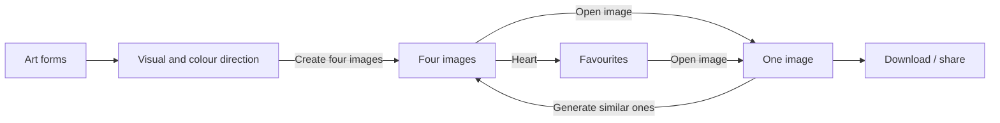

# Product and interaction design

Status: implemented local review revision, **2026-09-10**. The owner's simpler
journey below supersedes the 2026-09-09 multi-parent refinement and browser
recovery interface. Public name, usage terms, final curation and unfamiliar-user
review remain launch decisions. This is not a completed human usability study.

## The experience

Choose an art form, choose a direction, and immediately see four images.
Open one image to download, share or discover four similar compositions.
Favourites are simply the images the visitor chooses to keep together.

## Gallery and directions

Keep the quiet editorial layout, full uncropped images and short concrete
artwork descriptions. The three hero examples use different colour directions:
Pools in Tide, Foam in After dark, Iris in Earth. All are actual engine outputs
with committed recipes, dimensions, hashes and palette provenance.

On the second page, show illustrated visual and colour choices, including
“Keep it open” and “Let it surprise me”. Style examples use a common palette
for honest structural comparison; colour examples show their full compositions.
The primary action is **Create four images**. It submits a POST that admits
four previews before redirecting to the exploration. Merely viewing a page
never renders anything.

## Four images

Keep the selected visual and colour directions visible above the work as small
example images and human-readable names. Open choices have concise labels and
a quiet visual marker. Show four stable image slots with real “N of 4 ready”
progress while work is active. Completed images remain usable individually.

Each image has exactly two actions: **Open image** and a labelled heart to
add/remove a favourite. No multiple selection, generation controls, favourite
tray, batch history, recovery/export panel or storage explanations compete
with the work. A completely failed batch alone gets a small **Try again**
action. Individual unavailable images can be opened and explicitly downloaded
again. There is no automatic retry loop that creates more work.

## One image

Show the artwork on its own with a back link and a favourite heart. Keep its
three main actions close to the image and visible within a typical desktop
viewport: **Download image**, **Share image**, **Generate similar ones**.
On narrow screens, retain full-width art and stack the actions comfortably.

A download POST admits the same recipe at 1200 px. With JavaScript, the initial
click prepares it and starts the actual download when ready. Without JavaScript,
truthful **Prepare download** and **Download image** controls provide the same
file. GET/HEAD only deliver existing bytes. Do not show redundant preview and
high-resolution download buttons or implementation details.

Sharing prepares an existing image file before the click so the native share
sheet retains its required user activation. It uses the download rendition
when already available, otherwise the preview; it never creates a render.
Unsupported browsers receive a brief suggestion to download and share the file.
Share cancellation is normal. No public artwork URL is promised.

**Generate similar ones** uses precisely this image as its sole parent, whether
or not it is a favourite. All four new recipes keep its complete permitted
traits and palette with fresh composition seeds. Similar means the same visual
family, not a geometric mutation or a guaranteed improvement. The sample's
original direction labels travel with it when revisiting an older favourite.
CLI flock policy and artwork algorithms remain unchanged.

## Favourites and navigation

A global **Favourites** link opens one simple page containing kept images across
art forms. Open an image or remove its heart; there is no selection/refinement
mode. An empty page says how to add an image and links back to art forms.
Favourite actions stay on their originating grid, detail or favourites page.

Keep current favourites in the existing bounded server workspace. This revision
makes no browser-persistence promise and does not read or write localStorage.
The visible flow has no session, device, export, restore or clear controls.
The underlying retention limits remain operational facts documented in the
architecture and runbook. Downloading retains an independent copy.

Re-entering an art form reuses its exploration while preserving favourite
recipes and recent image links. One active batch per exploration, idempotent
actions, ownership/CSRF checks, finite history and generation limits continue
to apply. Failed admission must not change its direction or accumulate empty
explorations. Initial creation, download and similarity share the same render
quota, with a burst of three for the natural sequence and sustained limits of
12 actions per IP / 6 per workspace per minute.

## Accessibility and validation

Use native links, forms and buttons, visible focus, text heart labels, stable
image dimensions and uncluttered progress announcements. Essential actions
work without hover, storage access or JavaScript. Pending full pages refresh
only inside `noscript`; enhanced pages poll until ready. Do not reset focused
controls during an asynchronous update. UI contrast, screen-reader operation,
zoom and reflow require final human review before public launch.

Automated acceptance covers initial four-image admission, idempotency,
one-parent similarity without favouriting, repeated play, failure rollback,
shared rendering quotas, cross-artwork favourites, mobile reflow, actual PNG
downloads, native-share activation and the no-JavaScript journey. Inspect full
images and loaded desktop/mobile screenshots. These checks support review;
they do not substitute for observing unfamiliar visitors.

The rationale and primary sources are recorded in
[UX simplification](ux-simplification.md).
