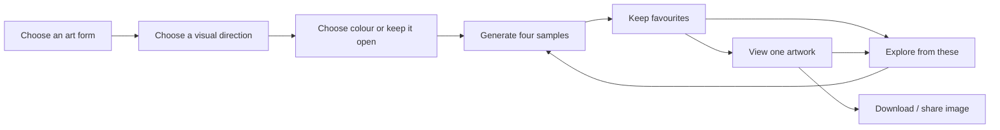

# Product and interaction design

Status: proposed. Product name, final artwork selection, and visual identity
remain owner decisions. This is a design brief and acceptance specification,
not a completed visual design or usability study.

## The experience

A visitor should be able to make an image they want to keep without learning
the generator's vocabulary. Let the work explain the choices: select an art
form, choose a visual direction, compare a few samples, and follow favourites.
Explain a control when it helps a choice, not as a prerequisite to beginning.

The key distinction is between **choosing a family of outcomes** and **choosing
a finished image**. Style examples guide generation; they are not promises
that every generated image will have the example's composition.

The visitor can skip style or colour selection, return to an earlier choice,
or download any completed sample immediately. Avoid a compulsory funnel with
several screens before the first useful result.

## 1. Gallery

Show three distinct launch artworks, not the entire developer registry.
`pools`, `foam`, and `iris` are candidates pending curation and provenance.
Use one large representative image per card and a short name plus a sentence
describing the visual experience. Additional examples should reveal real
range, not automatically animate on hover.

The first viewport should communicate that the images are things visitors
can explore and create. Use a direct action such as “Explore this artwork”.
Include a quiet statement that creation and low-resolution downloads are free.
Do not put server limits, seeds, version hashes, or renderer details into this
entry experience.

Preserve each artwork's aspect ratio with `object-fit: contain`. Do not crop
an iris, stretch a portrait, or crop away an artwork's designed margin to
achieve a uniform card height. An image's ground belongs to the image.

## 2. Visual direction

Offer three or four style cards for the chosen artwork, plus “Keep it open”.
Cards show full miniature compositions, not only isolated texture patches.
Each has a concrete label and one line of explanation. Example labels for
testing, not approved catalogue entries:

| Artwork | Candidate direction | Existing vocabulary to investigate |
|---|---|---|
| pools | Spacious circles | `fill` and `arrange`; keep numeric geometry overrides private |
| pools | Flowing strands | `flow` and `arrange`, with appropriate `fill` |
| foam | Ink and paper | `fills`, `line`, and permitted density choices |
| foam | Painted cells | Explicit `fills=watercolour`, with a curated `scheme` and fixed wash settings |
| iris | Fine fibres | `structure=fiber`, curated `grain` and `weave` |
| iris | Winding fibres | `weave=swirl`, preserving the disc identity |

Validate these mappings against current schemas and seed sweeps before naming
them publicly. A style may coordinate several choices, but it should leave
meaningful variation. It must be owned in one catalogue entry, not repeated
as conditional logic in handlers, templates and renderers.

For comparison, use several matched seeds with a common colourway: this helps
visitors see the changed dimension. Curate a representative image from that
comparison for each card. Avoid choosing rare outliers as the only example of
a common style. Publish exclusively assets whose recipe and provenance are
known; do not use QQL website screenshots or generated AI illustrations as
examples of this engine's output.

## 3. Colour

Show four to six curated colour directions for the chosen art form, each with
a miniature artwork and a small swatch strip. A swatch strip alone does not
show how colour occupies the composition, how dark the ground becomes, or how
pigments blend. Include an unpinned choice such as “Let it surprise me”.

The same label need not mean the same raw flag across artworks. Pools has a
`colourway` trait, QQL a `qql-palette` trait, several sketches use `cast`, and
iris also interprets its supplied palette. Public colour choices map through
the artwork's own configuration adapter. Never show the entire palette dataset
as a long initial dropdown.

A colour choice stays pinned during “Explore from these” until explicitly
cleared. Show that commitment in a small removable chip. Do not silently
recolour an existing favourite when choices change.

## 4. The studio

The central content is a stable grid of **four** images. Use a two-column grid
on wide screens and one or two columns according to actual mobile legibility;
full-image inspection must remain one action away. Reserve dimensions before
images arrive, and retain the previous batch while the next renders.

Use one primary action at a time: initially “Generate four”; with selected
favourites, “Explore from these”. Keep “Try something different” as a secondary
action that broadens unpinned choices. A visible favourite button and label
must work on touch and keyboard; nothing essential is hover-only.

Show actual progress such as “2 of 4 ready”, never a fictional percentage.
Already completed images remain selectable if another sample fails. Queued,
rendering, ready, failed, cancelled, expired and overloaded states have clear
copy and a useful action. Cancellation preserves ready samples and favourites.

Maintain a small favourites tray independent of the current batch. Propose a
maximum of 24 kept recipes and at most four favourites used in a refinement.
Explain the cap as a space to collect choices, with an export/clear action;
do not remove a favourite without the visitor's action or an explicit expiry
explanation. The tray contains recipes and thumbnails, not decoded full-size
images retained indefinitely.

At most one active batch per exploration. Duplicate clicks return to the
existing batch. Retrying after a dropped response must not create eight images
when the visitor asked for four.

## 5. What refinement means

Define separate actions with truthful guarantees:

| Action | What is held | What may change |
|---|---|---|
| Explore from these | Explicit pins; selected examples inform trait distribution | Unpinned traits and composition seeds |
| More with these settings | A chosen sample's full trait set plus explicit numeric settings | Seed-dependent composition and continuous draws |
| Try something different | Visitor's explicit pins | Remaining choices drawn from the public artwork's base space |
| Compare colours | One recipe's seed and other artistic choices | Only a certified colour choice, if that artwork supports it |

The first release needs the first and third actions. “More with these
settings” is useful if distinct enough in usability testing. Only offer
“Compare colours” where a multi-seed test shows the control preserves geometry;
independent RNG streams alone do not prove palette changes cannot affect a
packing or material decision.

Proposed four-sample refinement policy: two candidates reuse selected parents'
allowed traits with fresh seeds, one samples a preference-boosted distribution,
and one explores the base public distribution. Explicit pins win in all four.
Keep each selected parent represented over repeated batches. De-duplicate
recipes against the current batch and recent history, with a bounded attempt
count and an honest smaller batch if the allowed space is exhausted.

Recompute preferences from the currently selected favourites. Do not compound
boosts invisibly every time the button is pressed. Zero-weight material choices
remain unreachable unless the public style or visitor explicitly selected
them. A “painted cells” style must therefore hold the wash selection in every
candidate, including the exploratory one.

This policy is a product hypothesis to evaluate with visitors, not a trained
recommendation system. Preserve the existing CLI flock policy as its own
documented preset; sharing the planner does not require changing local breeding
ratios or existing seed streams.

## 6. Viewing and keeping a result

Open a selected image on its own uncluttered page with a stable back link to
the exploration. Place “Download PNG” and, where available, “Share image” near
the artwork. Keep seed/recipe/provenance details under an optional disclosure.

Propose a download rendition with a **1200 px maximum long edge**, 8-bit PNG,
native aspect, no watermark over the artwork. State the exact dimensions next
to the action. Artistic approval and VPS measurements may require a different
cap. “Low resolution” means lower than the local print profiles, not a blurry
preview. Start preview renditions around 600–800 px where the motif permits it;
render the download only when requested, and reuse it for subsequent shares.

Flame is an exception: if published later, its review rendition must meet the
1000² / quality-80 rule before downsampling gallery thumbnails. Its full render
cost is a publication decision, not an excuse to judge it at 600 px.

Use the same image bytes for downloading and native file sharing. File sharing
is progressive enhancement: verify `navigator.canShare({files})`, prepare the
file before the final share click so transient user activation is preserved,
and treat cancellation as normal. Unsupported browsers retain the download
action. [Web Share specification](https://www.w3.org/TR/web-share/).

No public link is promised in the baseline. Downloaded metadata records the
recipe, artwork edition and attribution, with no visitor identifiers. Sharing
the downloaded image remains possible if the service later disappears.

If the owner selects public links, use the extension in
[architecture](architecture.md#optional-public-artwork-links). A link to a
temporary job or expiring cache filename is not a shareable artwork address.

## Visual direction and frontend implementation

Aim for a small art publication with a working studio attached: generous
space, precise alignment, quiet neutral page surfaces, restrained typography,
and artwork providing most of the colour. Start with system fonts; a separately
licensed self-hosted typeface is a later design choice if it materially improves
the result. Avoid ornamental gradients, glass panels and generic dashboard
chrome that compete with the art.

Use CSS custom properties for spacing, type, foreground/background, selection,
focus and borders. Prefer the browser's layout, native controls and semantic
HTML; a custom build pipeline is unnecessary. Keep UI icons code-native SVG.
No generated imagery is required for this analysis or the interface itself.

Use restrained transitions only to clarify state changes, respect
`prefers-reduced-motion`, and avoid automatically shuffling or replacing images.
Batch slots keep their order as results arrive. Selection state is visible
without relying on colour alone.

Accessibility target: WCAG 2.2 AA, with visible focus, sufficient UI contrast,
text alternatives that describe relevant visual distinctions, and no keyboard
traps. Use 44 px action targets as a comfortable design target rather than
misstating the AA minimum. Test zoom/reflow, touch and screen-reader operation.
[WCAG 2.2](https://www.w3.org/TR/WCAG22/).

HTMX swaps must preserve useful focus, announce completion through a restrained
live region, and not force a scroll to the top. Back/forward, refresh and deep
navigation work through ordinary GET pages. When JavaScript is unavailable,
forms use POST/Redirect/GET and job pages offer a refresh link. Core generation,
favouriting within the active workspace, inspection and download still work;
browser recovery and native file sharing are enhancements.

## Validate before polishing implementation

First make a disposable visual prototype using real, locally generated artwork
assets. Compare gallery and studio layouts on mobile and desktop, with both
light and dark images and at least one portrait fixture. Do not begin by
building the entire infrastructure before confirming the central interaction.

Test with five people unfamiliar with generative-art controls. Provisional
success criteria: four can reach a download without guidance within five
minutes; all can explain the distinction between a favourite and a style;
none loses a kept result when generating again. Observe whether refinements
feel related and whether the visitor understands how to broaden again. These
are validation targets, not evidence already gathered.

Review full fixed-seed sheets for each style/colour combination, including
common, sparse, dense, weak and strong outcomes. Final approval belongs to the
artist; neither tests nor a selected hero image approve a whole output space.
